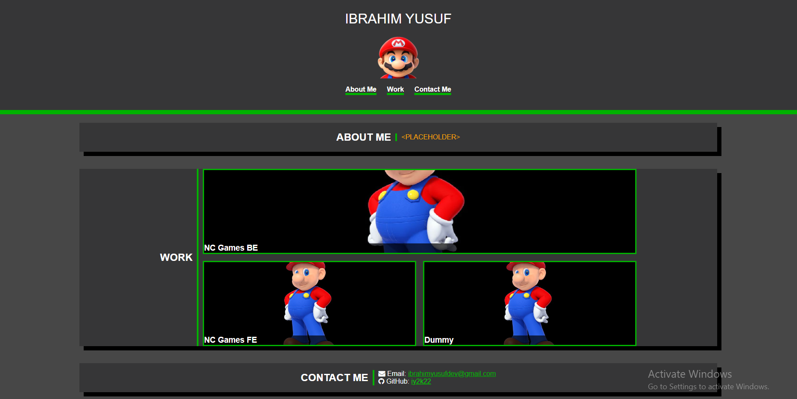

# Responsive Portfolio

My solution to the module 2 challenge of the edX front-end bootcamp. It's a simple portfolio.

## Usage
Simply open `index.html` in a web browser, or with the Live Server extension for VS Code.
[This site is also hosted on GitHub Pages.](https://iy2k22.github.io/responsive-portfolio/)

## Credits
* Icons belong to [Font Awesome](https://fontawesome.com).
* Mario belongs to [Nintendo](https://nintendo.com).
* Mark (Hairless Mario) is created by [yourfavisbald2](https://x.com/yourfavisbald2).